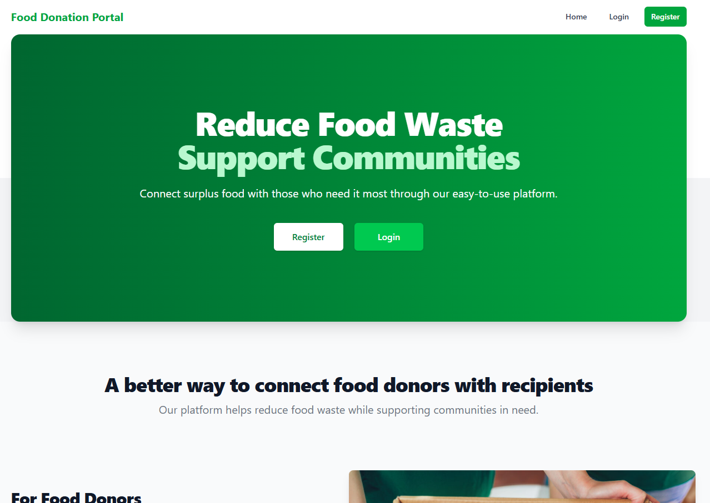
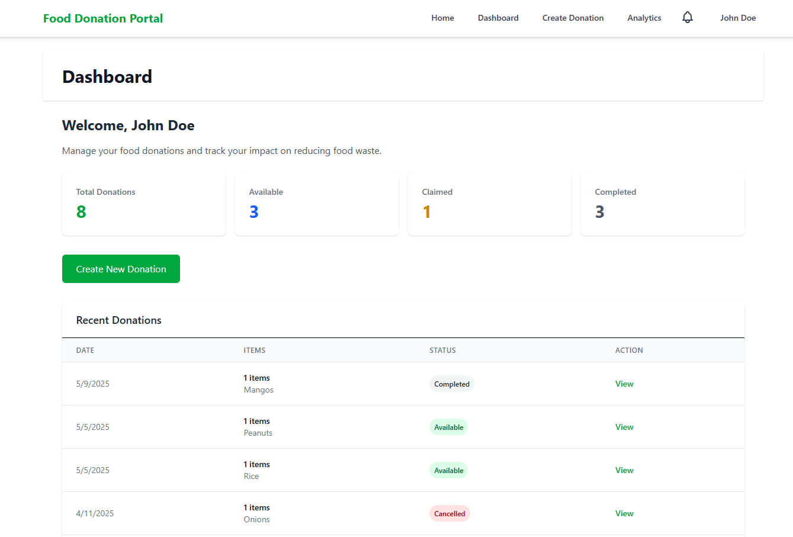
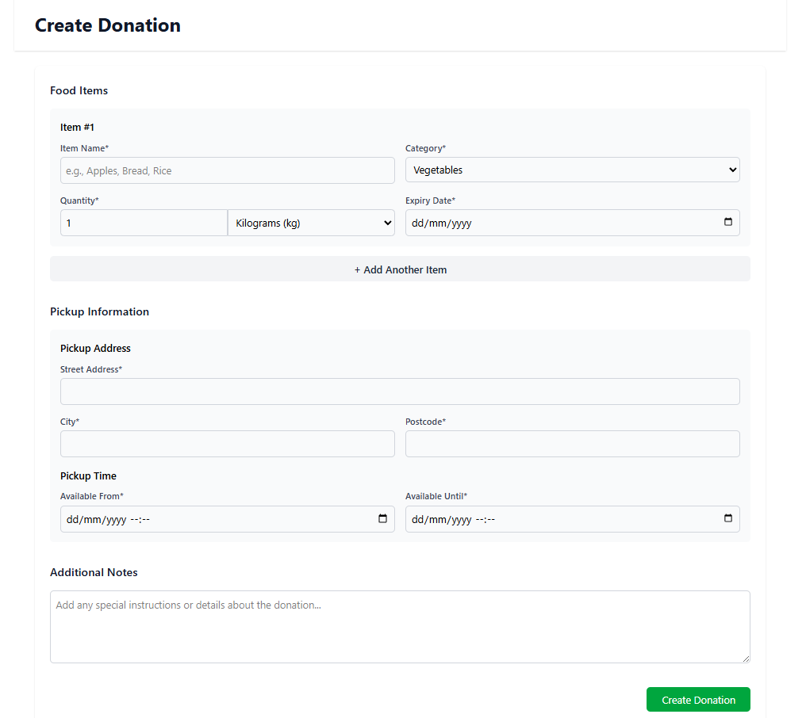
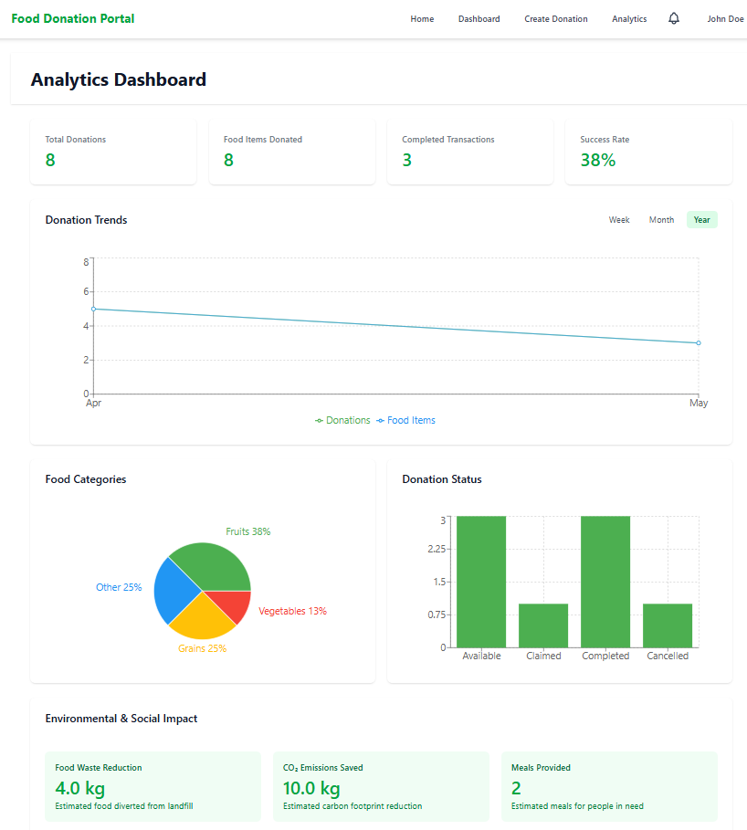

# Food Donation Portal

A full-stack web application designed to connect food donors with food banks, addressing the dual challenges of food waste and food insecurity. This platform streamlines the entire donation lifecycle, from listing surplus food to coordinating collection, creating an efficient ecosystem for food redistribution.

This was built as my final year computing project at Ulster University.

## 📸 Screenshots

Here are screenshots of the application's key features.

|                      1. Landing Page                       |                     2. Main Dashboard                     |
| :--------------------------------------------------------: | :-------------------------------------------------------: |
|  |  |

|                        3. Create Donation Form                        |                     4. Analytics View                     |
| :-------------------------------------------------------------------: | :-------------------------------------------------------: |
|  |  |

---

## ✨ Features

- **Donor Portal:** Allows businesses and individuals to list surplus food items for donation.
- **Food Bank Dashboard:** Enables charitable organisations to browse, filter, and claim available donations.
- **Donation Lifecycle Tracking:** Tracks the status of a donation (e.g., "Available," "Claimed," "Collected").
- **User Authentication:** Secure registration and login system for both donors and food banks (see `register.png`).
- **Fully Responsive:** A clean, mobile-first user experience that works across all devices.

---

## 🛠 Tech Stack

This project is a MERN-stack application, built with a modern, component-based frontend.

| Category       | Technology                                    |
| :------------- | :-------------------------------------------- |
| **Frontend**   | React (with Vite), React Router, Tailwind CSS |
| **Backend**    | Node.js, Express.js                           |
| **Database**   | MongoDB (with Mongoose)                       |
| **API Client** | Axios                                         |

---

## 🏁 Running the Project Locally

To get a copy of this project running on your local machine, follow these steps.

### Prerequisites

- Node.js (v18 or later)
- A free MongoDB Atlas account (or a local MongoDB instance)

### 1. Set Up the Backend (Server)

The backend code is located in the `/backend` folder.

```bash
# 1. Clone the repository
git clone [https://github.com/Faekster/food-donation-portal](https://github.com/Faekster/food-donation-portal)
cd food-donation-portal

# 2. Navigate to the backend directory
cd backend

# 3. Install backend dependencies
npm install

# 4. Create a .env file in the /backend directory
#    (This file is gitignored and must be created manually)
touch .env

# 5. Add your environment variables to the backend .env file
#    (Get your MONGO_URI from your MongoDB Atlas account)
PORT=5000
MONGO_URI=your-mongodb-connection-string-here
JWT_SECRET=your-secret-key-token-key-here

# 6. Run the backend server
npm run dev
# (Or "npm start", check your backend package.json "scripts")
```

The server will be running on http://localhost:5000

### 2. Set Up the Frontend (Client)

The frontend code is located in the root folder and the /src folder.

```bash
# 1. Open a NEW terminal window
#    (Keep the backend server running in the first terminal)

# 2. Navigate to the project's root folder
#    (the one you first cloned into)
cd path/to/food-donation-portal

# 3. Install frontend dependencies
npm install

# 4. Create a .env file in the ROOT directory
touch .env

# 5. Add the API base URL to the root .env file
#    (This tells your React app where to find the server)
VITE_API_BASE_URL=http://localhost:5000

# 6. Run the frontend client
npm run dev
```

The React application will open and be running on http://localhost:5173
